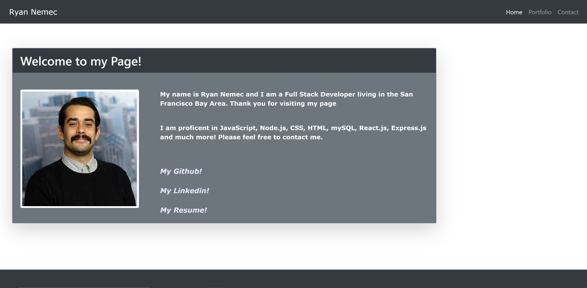
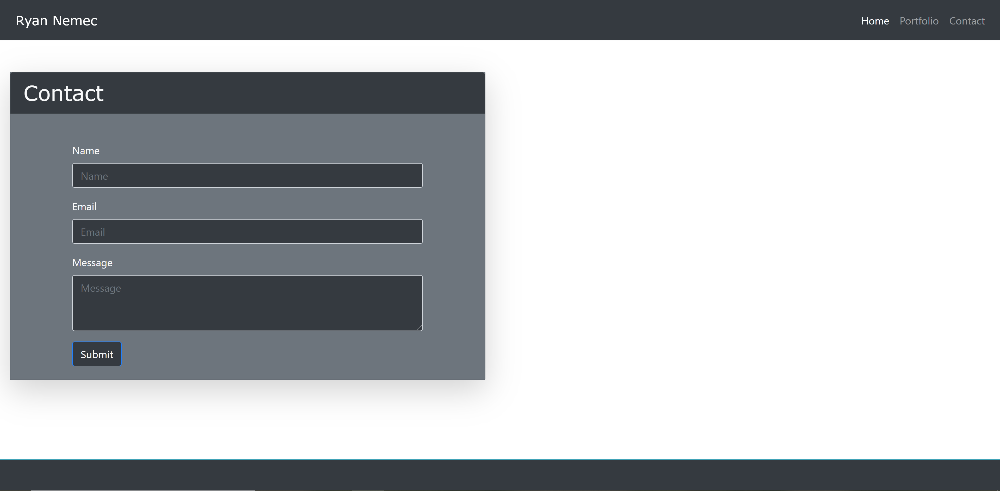
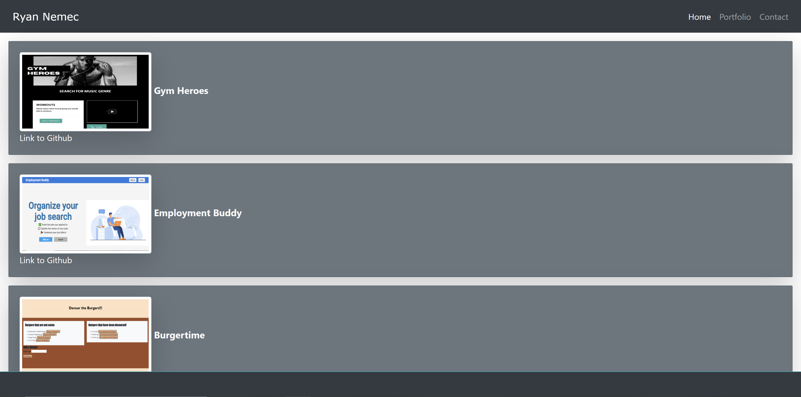

# Portfolio with Express

I created a website using HTML, CSS and utilzing my knowledge of Node.js, Express.js and backend server setup. I created a navigation bar with working links to the other pages. I created a card displaying my image and information about myself. I also created ways to display my portfolio and a form in which potential employers can contact me. 

### Screenshots

## Built With

* [HTML](https://developer.mozilla.org/en-US/docs/Web/HTML)
* [CSS](https://developer.mozilla.org/en-US/docs/Web/CSS)
* [Bootstrap](https://getbootstrap.com/)
* [React.js](https://reactjs.org/)

## Deployed Link

* [See Live Site](https://gentle-shelf-67923.herokuapp.com/)

## Author

* **Ryan Nemec** 

- [Link to Portfolio Site](https://perfectoment.github.io/Ryan-Portfolio/index.html)
- [Link to Github](https://github.com/perfectoment)
- [Link to LinkedIn](https://www.linkedin.com/in/ryan-nemec-5a6b3a66/)